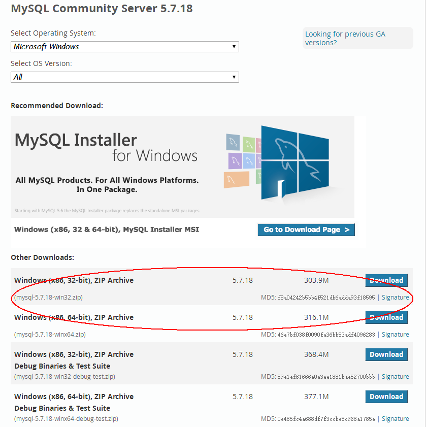
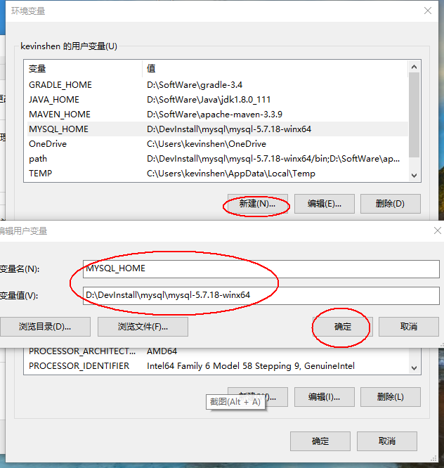
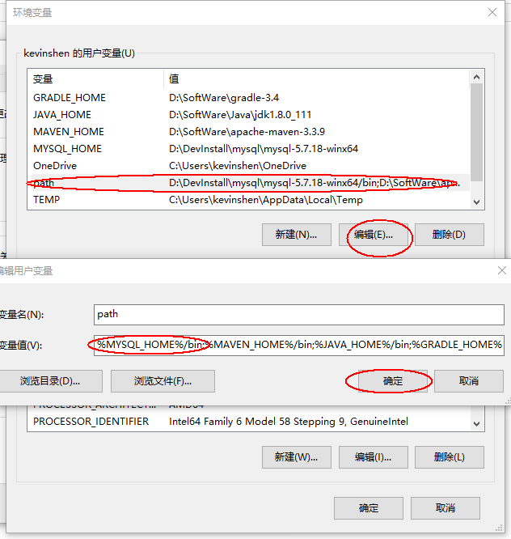
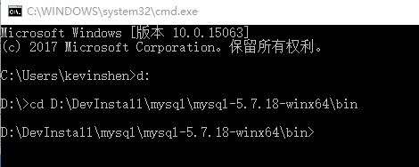

# MySql Server 5.7.18 安装流程

## 1. 下载MySQL Community Server 5.7.18
[去MySql官网下载zip安装包](https://dev.mysql.com/downloads/mysql/)

根据系统选择32、64位进行下载



## 2. 解压MySql压缩包

将以下载的MySQL压缩包解压到自定义目录下。

## 3. 添加环境变量

右击我的电脑→属性→高级系统设置→环境变量
在用户变量上点击`新建`
添加如下变量
```
变量名：MYSQL_HOME

变量值：D:\DevInstall\mysql\mysql-5.7.18-winx64
```


再在Path中添加  `%MYSQL_HOME%\bin`



如果没有Path则新建

## 4. 注册windows系统服务

将mysql注册为windows系统服务

操作如下：

1）从控制台进入到MySQL解压目录下的 bin 目录下：

`win+R`→输入`cmd`→输入对应盘符如 `d:` 回车→输入 `cd D:\DevInstall\mysql\mysql-5.7.18-winx64\bin` 回车



2）输入服务安装命令：

`mysqld install MySQL --defaults-file="D:\DevInstall\mysql\mysql-5.7.18-winx64\my-default.ini"
`


安装成功后会提示服务安装成功。

移除服务命令为：`mysqld remove`

注：`my-default.ini`文件在MySQL解压后的根目录下，如果没有，下面附上我的`my-default.ini`文件内容,只需要在MySQL根目录下新建txt文档，名称改为`my-default.ini`,再把下面的内容复制到文档里就可以了。

```
[mysql]
# 设置mysql客户端默认字符集
default-character-set=utf8 
[mysqld]
#设置3306端口
port = 3306 
# 设置mysql的安装目录
basedir=D:/DevInstall/mysql/mysql-5.7.18-winx64
# 设置mysql数据库的数据的存放目录
datadir=D:/DevInstall/mysql/mysql-5.7.18-winx64/data
# 允许最大连接数
max_connections=200
# 服务端使用的字符集默认为8比特编码的latin1字符集
character-set-server=utf8
# 创建新表时将使用的默认存储引擎
default-storage-engine=INNODB 
```

## 5. 启动MySQL服务

方法一：

启动服务命令为：`net start MySQL`


方法二：

打开管理工具 服务，找到MySQL服务。

通过右键选择启动或者直接点击左边的启动来启动服务。

## 6. 修改 root 账号的密码

刚安装完成时root账号默认密码为空，此时可以将密码修改为指定的密码。如：123456

方法一：
```
c:>mysql –uroot

mysql>show databases;

mysql>use mysql;

mysql>UPDATE user SET password=PASSWORD("123456")  WHERE user='root';

mysql>FLUSH PRIVILEGES;

mysql>QUIT
```
方法二：
利用第三方管理工具进行密码修改。如Navicatfor MySQL
```
GRANT ALL PRIVILEGES ON *.* TO 'myuser'@'192.168.1.3' IDENTIFIED BY 'mypassword' WITH GRANT OPTION;
```